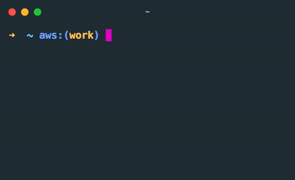
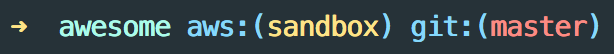

# AWSP - AWS Profile Switcher with MFA Support

Easily switch between AWS Profiles with automatic MFA-enabled AssumeRole functionality



## Features

- 🔀 Interactive AWS profile switching
- 🔐 Automatic MFA-enabled AssumeRole for configured profiles
- 📋 Automatic clipboard copy of credentials
- 🚀 Command-line interface with direct MFA code input
- ⚡ Environment variable export for immediate use

## Prerequisites

### Dependencies
- **AWS CLI**: For profile management and STS operations
- **jq**: For JSON parsing (install via `brew install jq` on macOS)
- **Node.js**: For the interactive interface
- **pbcopy**: For clipboard functionality (available on macOS by default)

### AWS Profile Setup
Setup your profiles using the AWS CLI:

```sh
# Basic profile setup
aws configure --profile PROFILE_NAME

# Or set default credentials
aws configure
```

For more information: https://docs.aws.amazon.com/cli/latest/userguide/cli-chap-getting-started.html

### MFA Configuration (Optional)
For profiles requiring AssumeRole with MFA, add the following to your AWS config (`~/.aws/config`):

```ini
[profile my-role-profile]
role_arn = arn:aws:iam::123456789012:role/MyRole
mfa_serial = arn:aws:iam::123456789012:mfa/my-username
source_profile = default

[profile another-role]
role_arn = arn:aws:iam::987654321098:role/AnotherRole
mfa_serial = arn:aws:iam::123456789012:mfa/my-username
source_profile = default
```

## Setup

```sh
npm install -g awsp
```

Add the following to your `.bashrc` or `.zshrc` config:
```sh
alias awsp="source _awsp"
```

## Usage

### Interactive Mode (Recommended)
```sh
awsp
```
- Displays a list of available AWS profiles
- For MFA-enabled profiles: prompts for MFA code and automatically assumes role
- For regular profiles: sets the profile conventionally
- Credentials are automatically copied to clipboard for MFA profiles

### Command Line Mode
```sh
# Switch to profile without MFA
awsp my-profile

# Switch to profile with MFA code
awsp -m 123456 my-role-profile

# Use with eval for immediate environment variable setting
eval $(awsp -m 123456 my-role-profile)
```

### Usage Examples

**Regular Profile Switching:**
```sh
$ awsp
AWS Profile Switcher
? Choose a profile my-regular-profile
set profile: my-regular-profile
```

**MFA-Enabled Profile:**
```sh
$ awsp
AWS Profile Switcher
? Choose a profile my-role-profile
? Enter MFA code: 123456
Successfully assumed role for profile: my-role-profile
# Credentials automatically copied to clipboard
```

**Direct Command Line:**
```sh
$ eval $(awsp -m 123456 my-role-profile)
Credentials copied to clipboard
# Environment variables are now set in current shell
```

## MFA Configuration Details

When a profile has both `role_arn` and `mfa_serial` configured:

1. **Interactive Mode**: Automatically prompts for MFA code after profile selection
2. **Credentials**: Temporary credentials are obtained via STS AssumeRole
3. **Clipboard**: Credentials are automatically copied in the format:
   ```
   AWS_ACCESS_KEY_ID=ASIA...
   AWS_SECRET_ACCESS_KEY=...
   AWS_REGION=ap-northeast-1
   AWS_SESSION_TOKEN=...
   ```
4. **Environment**: Variables are set in the current shell session

## Show your AWS Profile in your shell prompt

For better visibility into what your shell is set to, it's helpful to configure your prompt to show the value of the env variable `AWS_PROFILE`.



Here's a sample of my zsh prompt config using oh-my-zsh themes:

```sh
function aws_prof {
  local profile="${AWS_PROFILE:=default}"

  echo "%{$fg_bold[blue]%}aws:(%{$fg[yellow]%}${profile}%{$fg_bold[blue]%})%{$reset_color%} "
}
```

```sh
PROMPT='OTHER_PROMPT_STUFF $(aws_prof)'
```

## Troubleshooting

### Common Issues

**"jq: command not found"**
```sh
# macOS
brew install jq

# Ubuntu/Debian
sudo apt-get install jq

# CentOS/RHEL
sudo yum install jq
```

**"Error: role_arn or mfa_serial not configured"**
- Ensure your AWS config file (`~/.aws/config`) has the required `role_arn` and `mfa_serial` fields
- Check that the profile name matches exactly

**"Failed to assume role"**
- Verify your MFA code is correct and not expired
- Ensure your base profile credentials are valid
- Check that the IAM role trusts your user/account

## Security Notes

- Temporary credentials are automatically copied to clipboard for convenience
- Credentials are written to a temporary file (`~/.awsp-credentials`) which is immediately deleted after use
- MFA codes are not stored or logged anywhere
- AssumeRole sessions are limited to the role's maximum session duration